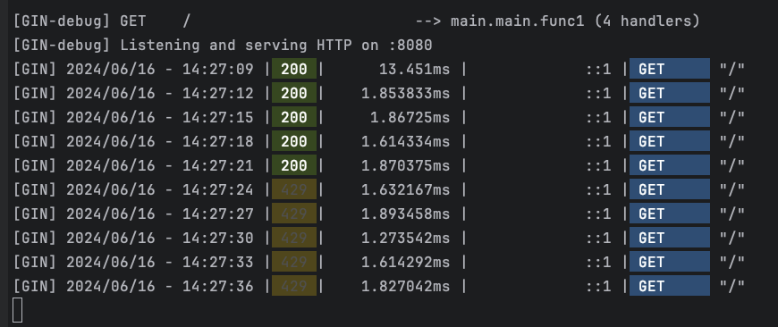

# Rate Limit

This code use Rate Limit with Tokens refied each 1 second

#### How to use

Makefile can help to up environment or run `docker-compose up --build -d`

`make`

#### Customization

You can change values in `.env`

        REDIS_ADDR=localhost:6379
        REDIS_PASSWORD=
        REDIS_DB=0
        RATE_LIMIT_IP=5
        RATE_LIMIT_TOKEN=4
        BLOCK_TIME=300
        REFILL_INTERVAL=1
        TOKENS_PER_REFILL=1
        MAX_TOKENS_PER_IP=5
        MAX_TOKENS_PER_TOKEN=10

#### Test

To test local command:

    for i in `seq 1 10`;do curl -X GET http://localhost:8080; sleep 3; done

#### Evidences

